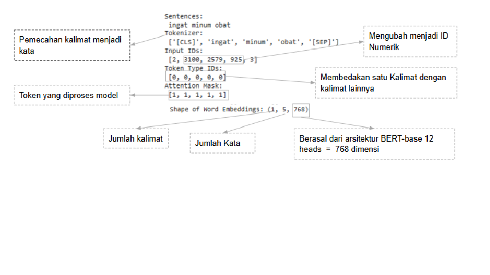

# Interaksi Human Following Robot Untuk Manusia Lanjut Usia dengan Voice Chatbot Menggunakan Natural Language Processing

Interaksi human following robot untuk manusia lanjut usia dengan voice chatbot menggunakan natural language processing dengan arsitektur transformer.

## Tech Stack

- Python
- Pandas
- Scikit_learn
- Tensorflow
- Transformer
- Indobert-lite-base-p2 
- BERT
- Flask
- Docker
- Jetson Nano

## Desain System

## Model 

### Data Acquisition

### BERT-MODEL

### Model Evaluation
